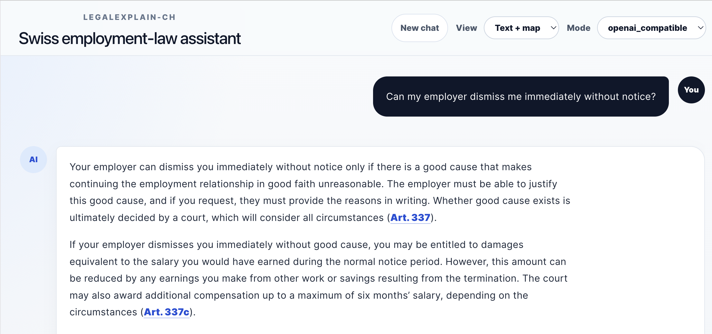
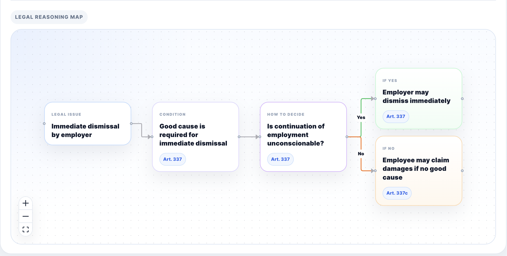
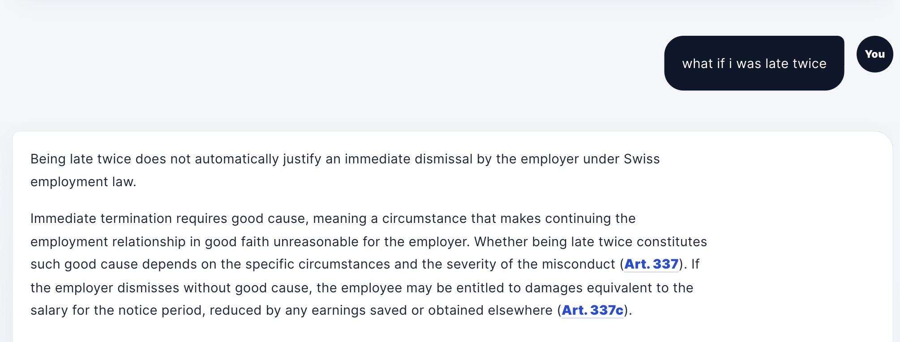

# LegalExplain-CH

**LegalExplain-CH** is a source-grounded legal RAG assistant for Swiss employment law. It answers user questions using retrieved legal sources, provides article-based citations, supports multi-turn follow-up questions, and can generate a visual legal reasoning map to help non-lawyers understand the structure behind an answer.

The project is designed as a portfolio demonstration of practical LLM/RAG system engineering, with attention to source grounding, retrieval quality, response reliability, user-facing explanation, and cost-aware generation modes.

## Status

This repository currently supports a local full-stack demo.

* Frontend: React + Vite
* Backend: FastAPI
* Retrieval: hybrid retrieval with dense and keyword retrieval, optional reranking
* Generation: OpenAI-compatible LLM backend
* Deployment: local full-stack demo

A local demo is recommended for the full RAG experience.

## Key Features

### Source-grounded legal answers

The assistant retrieves relevant Swiss employment-law sources and answers only from the retrieved legal context. Article references such as `Art. 337` and `Art. 337c` are included naturally in the answer and can be linked back to the source metadata.

### Hybrid legal retrieval

The backend supports hybrid retrieval by combining semantic dense retrieval with keyword-based retrieval. A reranker can be enabled locally for improved ranking quality.

### Multi-turn follow-up questions

The system keeps short conversation history in the frontend and rewrites follow-up questions into standalone retrieval queries when needed.

Example:

```text
User: Can my employer dismiss me immediately without notice?
User: What if I was late twice?
```

The second question is interpreted in the context of employer immediate dismissal and good cause under Swiss employment law.

### Visual legal reasoning map

The assistant can generate a compact legal reasoning graph showing the legal path behind an answer, such as:

```text
Immediate dismissal
→ Good cause is required
→ Continuing must be unreasonable
→ Yes: Employer may dismiss immediately
→ No: Employee may claim damages
```

This is intended to make legal reasoning more understandable for non-lawyers.

### Cost-aware response modes

The frontend supports different response modes:

* **Text only**: faster and lower-cost answer generation
* **Map only**: visual reasoning map generation
* **Text + map**: richer explanation with both answer and legal reasoning map

This design separates the core answer from optional explanation layers.

## Example Questions

```text
Can my employer dismiss me immediately without notice?
Can I leave my job immediately without notice?
What does Swiss employment law say about salary payment?
What are the employee's duties of loyalty and care?
```

## Example Output

For the question:

```text
Can my employer dismiss me immediately without notice?
```

The system should explain that an employer may terminate the employment relationship with immediate effect only for good cause under `Art. 337`. If the employer dismisses the employee without good cause, the employee may be entitled to damages and possible compensation under `Art. 337c`.

## Screenshots







## Tech Stack

### Backend

* Python
* FastAPI
* Pydantic
* Chroma
* sentence-transformers
* rank-bm25
* optional cross-encoder reranking
* OpenAI-compatible chat completion API

### Frontend

* React
* TypeScript
* Vite
* React Flow
* CSS

### LLM / API

The backend is configured through environment variables and supports OpenAI-compatible chat completion endpoints.

Example local configuration:

```env
LLM_API_KEY=your_api_key
LLM_BASE_URL=https://api.openai.com/v1
LLM_MODEL=gpt-4.1-mini
```

The OpenAI API key should only be used on the backend. It should never be exposed in frontend code.

## Project Structure

```text
LegalExplain-CH/
├── backend/
│   ├── app/
│   │   └── main.py
│   ├── generation/
│   │   ├── answer_generator.py
│   │   └── prompts.py
│   ├── retrieval/
│   │   ├── dense_retriever.py
│   │   ├── keyword_retriever.py
│   │   ├── hybrid_retriever.py
│   │   ├── reranker.py
│   │   └── schemas.py
│   ├── services/
│   │   └── workflow.py
│   ├── tests/
│   └── requirements.txt
├── frontend/
│   ├── src/
│   │   ├── App.tsx
│   │   ├── App.css
│   │   ├── api.ts
│   │   └── main.tsx
│   └── package.json
├── data/
│   ├── raw/
│   └── processed/
├── docs/
│   └── screenshots/
├── scripts/
└── README.md
```

## Local Setup

### 1. Clone the repository

```bash
git clone https://github.com/JingmiaoLi/LegalExplain-CH.git
cd LegalExplain-CH
```

### 2. Set up the backend

Create and activate a virtual environment:

```bash
python -m venv .venv
source .venv/bin/activate
```

Install backend dependencies:

```bash
pip install -r backend/requirements.txt
```

Create a local `.env` file in the project root:

```env
LLM_API_KEY=your_api_key
LLM_BASE_URL=https://api.openai.com/v1
LLM_MODEL=gpt-4.1-mini
```

Start the backend:

```bash
uvicorn backend.app.main:app --reload
```

The backend should be available at:

```text
http://127.0.0.1:8000
```

FastAPI docs:

```text
http://127.0.0.1:8000/docs
```

### 3. Set up the frontend

Open a second terminal:

```bash
cd frontend
npm install
npm run dev
```

The frontend should be available at the local Vite URL, usually:

```text
http://localhost:5173
```

## Environment Variables

### Backend

```env
LLM_API_KEY=your_api_key
LLM_BASE_URL=https://api.openai.com/v1
LLM_MODEL=gpt-4.1-mini
```

### Frontend

For local development, the frontend defaults to:

```text
http://127.0.0.1:8000
```

If using a hosted backend, set:

```env
VITE_API_BASE_URL=https://your-backend-url
```

Do not store API keys in frontend environment variables.

## Design Notes

### Why source grounding matters

Legal information systems must avoid unsupported legal claims. This project therefore retrieves relevant legal sources first and instructs the language model to answer only from those sources.

### Why reasoning maps are optional

A legal reasoning map can make the answer easier to understand, but it is not always necessary. The project separates text answer generation from graph generation to support different latency and cost trade-offs.

### Why local and cloud deployment differ

The local version can use heavier retrieval components such as dense embeddings and reranking. Cloud deployment on low-memory free tiers may require a lighter retrieval backend or API-based embeddings. The repository currently prioritizes the complete local RAG experience.

## Limitations

* The system provides legal information, not legal advice.
* The quality of the answer depends on the retrieved sources.
* The current cloud deployment is being optimized for memory constraints.
* The legal reasoning map is an explanatory aid and should not replace careful legal review.
* The current source scope is focused on selected Swiss employment-law materials.

## Future Improvements

* Add a lightweight cloud retrieval mode using precomputed API-based embeddings
* Improve online deployment stability under low-memory hosting limits
* Add streaming text answers for better perceived latency
* Add a hidden debug panel for retrieval and timing information
* Expand legal source coverage
* Improve graph layout and visual hierarchy
* Add automated evaluation for retrieval quality and answer grounding

## Disclaimer

This project is for educational and portfolio purposes. It provides source-grounded legal information based on retrieved materials, but it does not provide legal advice. For real legal issues, users should consult a qualified legal professional.
